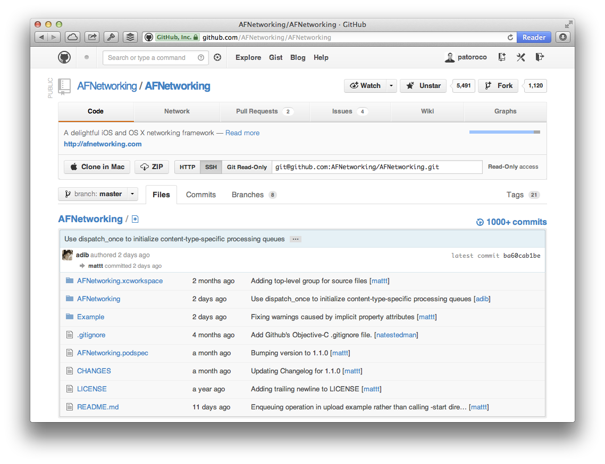
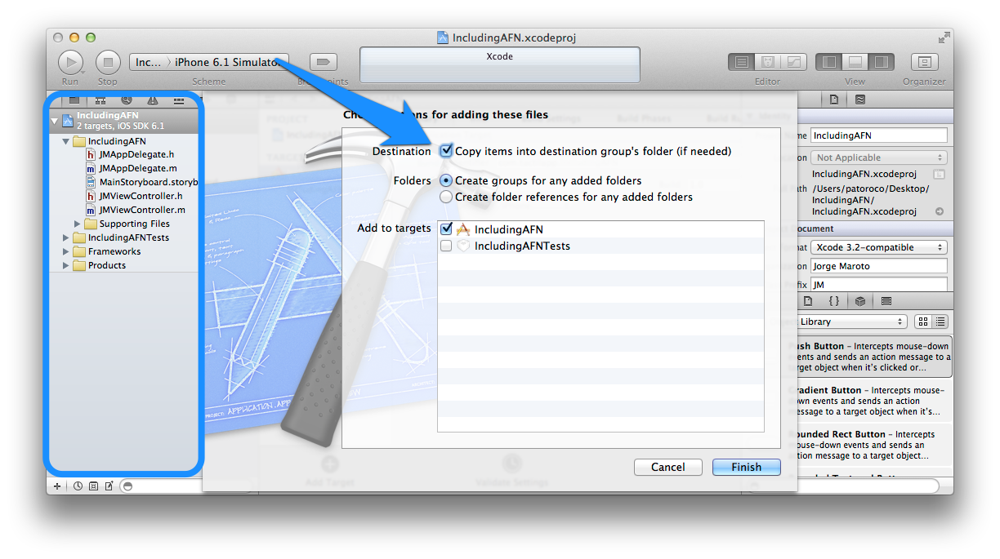
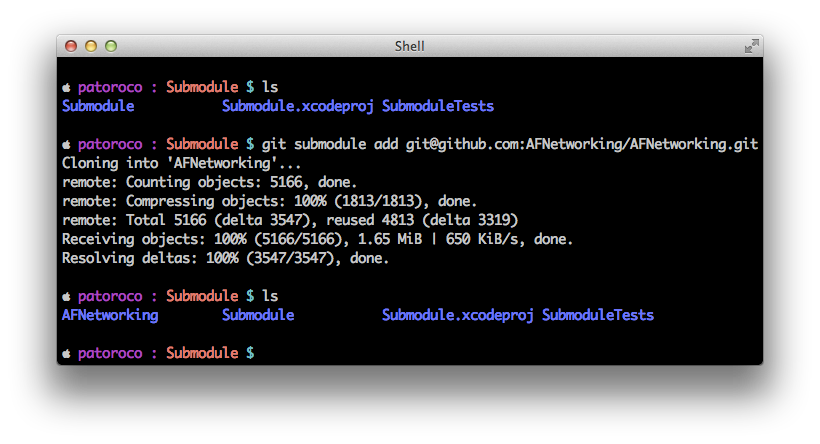

As you know, **AFNetworking** is a library that helps you in the laborious task of managing connections and requests from your applications. This chapter explains how to include and set it up in an iOS project.  

The first step that you need to know is how to include the library, which could be done by three different ways as follows:

* Download and copy the source.
* Submodule git. 
* Cocoa Pods.

We will be looking at these in this chapter.  

The first method is good in order to practice with the library, but it’s better to use the second or third way to be updated with AFNetworking project, which is changing and improving every day.

## 1.1. Where can I buy AFNetworking framework?

AFNetworking is hosted in **GitHub**, an online project hosting based on **git SCM** (Source Code Management).

If you didn’t know GitHub, believe me, you’ll love it. Why? A lot of developers are sharing their projects here so you can browse their sources (that’s the best part) totally free!

To get AFNetworking framework, you can go to GitHub’s project page [https://github.com/AFNetworking/AFNetworking](https://github.com/AFNetworking/AFNetworking) and download it directly from here (see image).



You also could fork the project to your GitHub account, but that is out of scope of this book, so if you are interested in I suggest that you search a specialized git book and learn to use it because it’s very useful for develop both alone and when you work with others.

## 1.2. Installing from the source

At the top of GitHub you will see a `ZIP` button, clicking it you’ll obtain last release of AFNetworking’s source compressed in a `.zip` file (you can download it from [https://github.com/AFNetworking/AFNetworking/archive/master.zip](https://github.com/AFNetworking/AFNetworking/archive/master.zip) directly). You'll need to double click on it to uncompress.

The folder that you will have obtained has the following structure:

* AFNetworking folder.
* *AFNetworking.xcworkspace* file.
* Example folder.
* Some other files which aren’t interesting at the moment.

If you are an early adopter, you can open *AFNetworking.xcworkspace*, and you’ll see two application examples, one for OS X and another for iOS. Feel free to try each one, but the rest of this book will focus on iOS version, and when you have played enough with the examples, we go to include AFNetworking in our project.

For this, you need to create a new project (or use your current project), and drop AFNetworking subfolder to XCode Project Navigator (circled area on image below). When a dialog appears, don’t forget to choose `Copy items` to put the files inside your project as you can see pointed with the arrow as follows:



If you try to run it at this moment, you’ll receive a warning from the compiler. This is because you need to add some SDK frameworks to your project before continuing, so here we go!


### 1.2.1. Adding the required frameworks

On the Project Navigator, click on your project file (1 on the image) and choosing summary tab scroll to `Linked Frameworks and Libraries` section, where you need to click on plus to add *MobileCoreServices.framework* and *SystemConfiguration.framework* from the list that will appear.


Only one more thing, you need to add both frameworks to precompiled headers, so in the Project Navigator look for a file with `.pch` extension and open it (usually it’s under a `Supporting Files` folder). You need to add two lines between `#ifdef macro`. Final result should be anything like the following:

```obj-c
#ifdef __OBJC__
    #import <UIKit/UIKit.h>
    #import <Foundation/Foundation.h>
    #import <SystemConfiguration/SystemConfiguration.h>
    #import <MobileCoreServices/MobileCoreServices.h>
#endif
```

That’s all! You can run it now, and if all was ok you should have a white screen in front of you. Don’t worry, in the chapter 2 we’ll add some functionality to your killer-app :).

## 1.3. Include AFNetworking as git submodule

One of the advantages of using GitHub instead of hosting your files on a common web is that you’ll be notified of updates on real-time. That means that any feature, which is added by the library’s author, could be downloaded just at this moment. Awesome, isn’t it?  

Using the first way to include AFNetworking in your project (downloading a static `.zip` file) will make you lose this functionality, so in this subsection we’ll learn how to include full git repo on our project and how to continue receiving new features when AFN’s contributors update it.  

In the first place, we’ll need to have installed git on our system. The easiest way is using Components Download Dialog on XCode, so we can go to `XCode Menu | Preferences | Downloads` and choose Download the `Command Line Tools`.  

Once installed, you can go to your project’s folder and clone git repo executing:
  
```
git submodule add git@github.com:AFNetworking/AFNetworking.git
```

Now you can see a new folder *AFNetworking* in root project folder, that’s the last commit on AFNetworking’s repo.

  


Now, you can follow the same process that you learned in the first section of this chapter, installing from the source with these files. The only thing that you need to be aware of is deselecting `Copy Items` check on the dialog, because you already have these files in your project folder.  

 > AFNetworking project includes some examples that aren't required in our project, so you only need include folder with framework’s classes inside of this.
 
Easy, isn’t it? Now we’ll see an even simpler method for adding AFNetworking to a project.

## 1.4. Installing with Cocoa Pods

Cocoa Pods is a library managed for XCode, like an `apt-get` for installing libraries from command line. You can find more info on their website: [http://cocoapods.org/](http://cocoapods.org/).

### 1.4.1. Installing Cocoa Pods gem
Cocoa Pods is distributed as Ruby gem, so to install it, open a Terminal and write:

```bash
sudo gem install  
pod setup
```

Once installed you can execute several commands from command-line, more info about that on the following website: [http://cocoapods.org/](http://cocoapods.org/).


### 1.4.2. Adding AFNetworking to the project
Each project that uses Cocoa Pods needs to create a *Podfile* file with specifications about packages used in the project. In our case we’ll create a Podfile (using *vim* editor for example) with the following content:

```
platform :ios, '6.0'  
pod 'AFNetworking', '1.0'
```
From this moment, you change from open *&lt;your_project&gt;.xcodeproj* file to *&lt;your_project&gt;.xcworkspace*, and you’ll see that a project named Pods was included on this workspace which does all the magic: you can forget to download manually third party libraries, Cocoa Pods will do this for you!

 > It’s necessary to include iOS version > 4.3 because AFN doesn’t support lower versions.
	
	
	
	
	

## 1.5 Summary
In this chapter we learned how to include AFNetworking in our project using three different ways from the easiest to the most powerful. Last method i.e. using Cocoa Pods is very interesting to include and maintain updated third parties libraries on our projects with little effort.  

In the next chapter we’ll make a ‘Hello world’ app (with this name is known the easiest app that you can make in a specific language), which will consist in to read a simple file from Internet and show it on screen.

