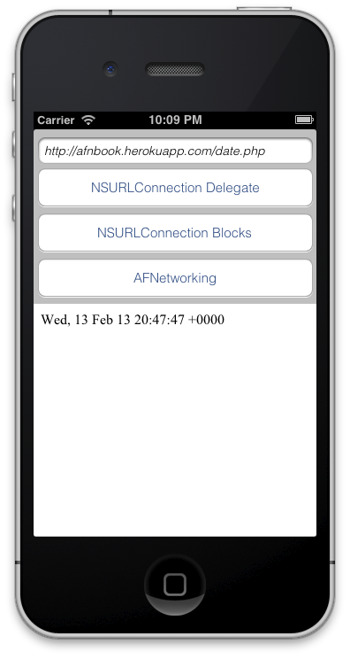

The first program that people often use to start with any programming language is known as the *"Hello World"*, a simple program to understand how to show characters on console or create a UIView on iPhone’s screen for example.  

This book is about **AFNetworking**, a network library, so in this chapter we will make the minimal app to understand how to start using AFNetworking: reading a simple stream from Internet.  

First we would use the ‘old-style’ with SDK provided by Apple, that’s `NSURLConnection` in two different ways. After that, we’ll see how to do this easier using a framework for manage connections, in this case with AFNetworking.

## 2.1. Building the skeleton of our application

We will work during the entire chapter on the same application, which will show the content of a file available on Internet. For this purpose we’ll learn how did this task before AFNetworking, and finally we’ll show how easy it is using this awesome library.  

As you can see in following figure, the layout is very simple: that’s only a textfield for introduction to the URL of the request, a webview, where we’ll load the results and three options to do request using each method explained below.  

  

For convenience variable names in the rest of this chapter, you can copy following IBOutlets variable names.

```obj-c
@interface JMViewController ()
	@property (weak, nonatomic) IBOutlet UITextField *urlField;
	@property (weak, nonatomic) IBOutlet UIWebView *webView;
@end
```

We also deploy some server-side scripts to take as example for the book. Often they are very simple, but if you are curious, you can find them on Github ([https://github.com/patoroco/AFNBook_Server](https://github.com/patoroco/AFNBook_Server)).  

In this chapter we use a simple script written in PHP to show the current datetime ([http://afnbook.herokuapp.com/date.php](http://afnbook.herokuapp.com/date.php)), so it’s better to set this URL as default on `viewDidLoad` method.  

```obj-c
@implementation JMViewController
- (void)viewDidLoad{
	NSString * const sampleURL = @"http://afnbook.herokuapp.com/date.php";
	self.urlField.text = sampleURL;  
	[super viewDidLoad];
}
@end
```  

We suppose that you don’t have any trouble until now; anyway, if you find any problem following this (or others) chapters, remember that you have all the samples of this book in a Github repository ([https://github.com/patoroco/AFNBook_Samples](https://github.com/patoroco/AFNBook_Samples)), so feel free to use it when you need.  

That’s all your layout needs, so go ahead and add some functionality to this empty app.

## 2.2. Making requests without external libraries  

Official SDK provided by Apple includes some classes to make a request, as we’ll see in this chapter. That’s ok for small requests in your application, but when you need make several queries to a server, or manage images, files, or whatever from internet, you’ll start feeling overloaded.  

Anyway, it’s good to know how things run in the backstage, so this first part of the chapter will show you to use connections almost manually, and for this you don’t need any third part library. Exist several forms to create *NSURLConnection*, but here we’ll show two of the most popular: using delegate or using blocks.

### 2.2.1. NSURLConnectionDelegate  

The first way that we’ll learn is make a request and manage the data using a delegate that tell us what happen with our connection.  

Using this method, we need to add a new *NSMutableData* property to our controller. This property will save the data received from Internet, and a delegate will be called when download process finish and we can use the data in our application.  

```obj-c  
@interface JMViewController ()  
    @property (strong, nonatomic) NSMutableData *data;  
@end  
```  

After that, we declare first a *NSURL* using the string in the textfield, and then use this to create a simple *NSURLRequest* (without more parameters). The last step is to pass this *NSURLRequest* to *NSURLConnection* class, which will begin the request automatically and return callbacks to delegate methods of the object as you can see in following code.  

```obj-c  
- (IBAction)requestWithNSURLConnectionDelegate {  
    NSURL *url = [NSURL URLWithString:self.urlField.text];  
    NSURLRequest *req = [NSURLRequest requestWithURL:url];  
    [NSURLConnection connectionWithRequest:req delegate:self];  
}
```

If you run the application at this moment, you won’t see anything, because you need to implement delegate methods as follows.  

```obj-c
#pragma mark - NSURLConnection delegate methods  
- (void)connection:(NSURLConnection *)connection didReceiveResponse:(NSURLResponse *)response{  
    self.data = [NSMutableData data];  
}  

-(void)connection:(NSURLConnection *)connection didReceiveData:(NSData *)data{  
    [self.data appendData:data];  
}

-(void)connection:(NSURLConnection *)connection didFailWithError:(NSError *)error{  
    [self.webView loadHTMLString:error.localizedDescription baseURL:nil];  
    [self.urlField resignFirstResponder];  
}

-(void)connectionDidFinishLoading:(NSURLConnection *)connection{
	NSString *responseString = [[NSString alloc] initWithData:self.data encoding:NSUTF8StringEncoding];  
    [self.webView loadHTMLString:responseString baseURL:nil];  
    [self.urlField resignFirstResponder];  
}
```  

The first method is called when the *NSURLConnecion* starts, so at this point you only need to initialize *NSMutableData* variable. This is done each connection because you could want to press the same button several times so data will be ‘corrupted’.  

Second method is called each time that connection receives data. You can think that this method is called only one time by request, but now think about a big file, for example a .zip of 100MB. Data comes from Internet in packages, and that’s the main reason to use a *NSMutableData* instead of *NSData*, so the purpose of this method is append all data received until the finish loading delegate method is performed.  

The last two methods notified this final, the first is performed when any error related with *NSURLConnection* happens, and the second when all was ok, so you could convert the data to *NSString*.  

In this case we are waiting a simple string, but is your responsibility taking care about MIME type, for example to create an image, a Microsoft Word file or whatever. That’s starting to be complicated, isn’t it?

### 2.2.2. NSURLConnection Block

The second way that we’ll learn to deal with *NSURLConnection* is using blocks. For me, that’s less ‘magical’ than using delegates, but continues doing hard when you need manage more than only one request. Anyway, you need to know the hard form to understand the true value to have a good framework that does all the work for us, as we’ll see soon.  

The first thing that we need to do is add a queue to our controller, where we’ll send all request and will be managed in background, so add to your interface as follows.  
  
```obj-c  
@interface JMViewController ()    
    @property (strong, nonatomic) NSOperationQueue *queue;    
end  
```

We also need to initialize that queue, so *viewDidLoad* is a good place for this task. We can also use this method to set the text for our textfield with a fixed URL as follows.  

```obj-c
- (void)viewDidLoad{
    self.queue = [[NSOperationQueue alloc] init];
    self.urlField.text = sampleURL;  
    [super viewDidLoad];  
}  
```  

On this occasion, we’ll make an asynchronous request and specify what happens when it will be finished, this is calling to *sendAsynchronousRequest* method in *NSURLConnection* class.  

It’s important to take care about errors, because we must to handle them. Usually it’s done with a simple if as follows.  

```obj-c  
- (IBAction)requestWithNSURLConnectionBlock:(id)sender {  
  
NSURL *url = [NSURL URLWithString:self.urlField.text];  
NSURLRequest *req = [NSURLRequest requestWithURL:url];  
  
[NSURLConnection sendAsynchronousRequest:req queue:self.queue  
   completionHandler:^(NSURLResponse *response, NSData *data, NSError *errorConnection) {  
  
       if (!errorConnection){    

           NSString *responseString = [[NSString alloc] initWithData:data encoding:NSUTF8StringEncoding];  
           [self.webView loadHTMLString:responseString baseURL:nil];    

       }else{    

           NSString *errorString = errorConnection.localizedDescription;  
           [self.webView loadHTMLString:errorString baseURL:nil];    

       }  
  
		[self.urlField resignFirstResponder];  
}];    

}
```
  
One more time, you need to convert manually data received from Internet (think on it as ‘binary’ data) to your specific situation, on this case to *NSString* using UTF8 encoding. Some websites are on different encodings, so you if you detect strange characters on your final string, maybe you need to change data encoding.  
  
Finally, load these string into your webview and hide keyboard, because it could have  been showed to input URL in textfield.

## 2.3. Using AFNetworking  
  
Finally going to use the library from which this book is, *AFNetworking*. To summarize what it is, we can say that AFNetworking encapsulates *NSURLConnection*, *NSOperations* and queues to make life easier to developers when they want to make URL requests.  
  
This was the starting point, but as you can discover at last chapters on this book, a big ecosystem has been created around this library, and exists a lot of libraries to do different tasks of specific way.  
  
In the first place, we need to add *AFNetworking* to our project as we learnt at the first chapter. We prefer to use **Cocoa Pods** for it, but you are free to choose your preferred method.  
  
Edit **Podfile** with your favorite text editor and include following lines on it.  
  
```obj-c  
platform :ios, '6.0'  
pod 'AFNetworking', '1.0'  
```  
  
After that, you only need to download updated pods, so open a terminal and execute `pod install`. From this point, remember to open *xcworkspace* file instead of *xcproject*, because it includes Pod files inside of it.  
  
Work with *AFNetworking* changes a little bit the code flow, simplifying it because it uses blocks instead of delegates that seem more magical.  
  
First step is to create a *NSURLRequest* from a NSURL as is usual, and after we create an *AFHTTPRequestOperation* which will be managed in a queue without to having to worry about it.  
  
Finally call to start method as follows.  
  
```obj-c  
- (IBAction)requestWithAFN {  
	NSURL *url = [NSURL URLWithString:self.urlField.text];  
	NSURLRequest *req = [NSURLRequest requestWithURL:url];    

	AFHTTPRequestOperation *operation = [[AFHTTPRequestOperation alloc] initWithRequest:req];  
	[operation setCompletionBlockWithSuccess: ^(AFHTTPRequestOperation *operation, id responseObject) {  
  
		NSString *stringResponse = [[NSString alloc] initWithData:responseObject  
			encoding:NSUTF8StringEncoding];  
		[self.webView loadHTMLString:stringResponse baseURL:nil];  
  
	} failure: ^(AFHTTPRequestOperation *operation, NSError *error) {  
  
		[self.webView loadHTMLString:error.localizedDescription baseURL:nil];  
  
	}];  
  
	[operation start];  
  
	[self.urlField resignFirstResponder];  
}  
```  
  
As you have seen, each *AFHTTPRequest* operation has a completion block and a failure block where you can execute your code once time request has been finished. This time we are working with a simple HTML string, so you only need to convert *NSData* received to a *NSString* according to encoding, in this case UTF8, but it could be a PNG file or whatever (don’t worry about it, *AFNetworking* include some subclasses and categories that will do this work by you ☺).

## 2.4. Summary

On this chapter you have learned how to make simple requests to get a text file from Internet and display its contents in a webview.  

We have started with *NSURLConnection* which is included on basic iOS SDK, and we did it in two different ways: using delegates and using blocks. These methods run correctly, but when your application starts to grow up, is very difficult to maintain, and here comes *AFNetworking* to help us.  

Final part of the chapter shows how easy is to read text file using AFNetworking, and this is just the beginning, because when *AFNetworking* starts to be very powerful is when you have several connections in different classes and you don’t need to worry about queues, operations, etc.  

In the next chapter we’ll learn how to manage some file types, as **plist**, **XML** and **JSON** to get information to configure or display in our application. We also see an awesome *UIImageView* category that helps us to forget the uncomfortable task of handling the loading of images asynchronously with cache if you need.

