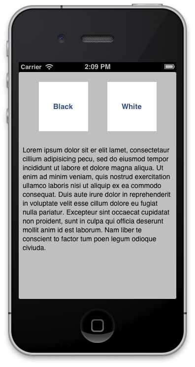
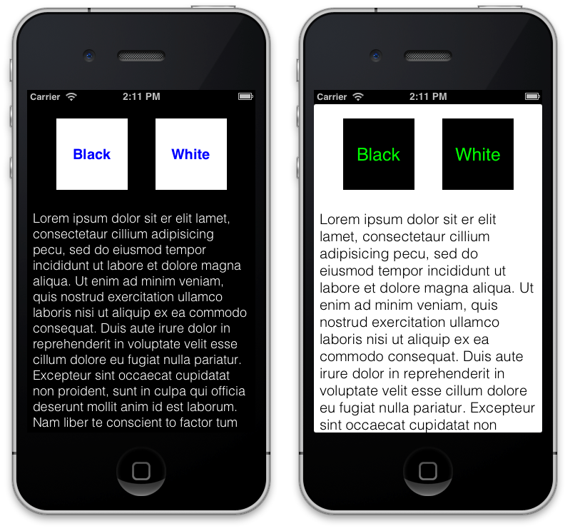

At this point you know to get simple text documents from internet, but usually you’ll need manage more complex data i.e. JSON, XML, so on this chapter we’ll learn how to do that using some helpers that AFNetworking provides.  

This chapter will be very important because almost all social networks or web services in general use these kinds of structured files on their APIs, so we’ll dedicate the next full chapter for this purpose.  

At last of this chapter, we’ll teach you another helper includes in AFNetworking as objective-c category that extends UIImageView class, and is very useful to manage asynchronous image downloads.

## 3.1. Loading structured data in our app
As first part of this chapter, we’ll learn how to use structured data loaded from Internet in our applications. This will be done using three different helpers that AFNetworking provides, one by each kind of file:  

* Property list files (**.plist**).
* JavaScript Object Notation (**JSON**).
* Extensible Markup Language (**XML**).  

All knowledge explained here will be used in next chapter to consume different public APIs, so please pay attention.

## 3.2. .plist
This kind of file is popular because is one of the easiest ways to persist data when you develop an application.  

Basically is a subset of XML files which uses a `DTD` (Document Type Definition) defined by Apple (you can see this definition on [http://www.apple.com/DTDs/PropertyList-1.0.dtd](http://www.apple.com/DTDs/PropertyList-1.0.dtd)) which include the most popular data types (string, number, array, object) and provides help when you need to manage the data included in, turning file in a **NSDictionary** that is easy to handle by programmer. In the same way, it’s easy to convert a NSDictionary to a `.plist` file, but that’s out of scope of the book.  

For understand the utility of `.plist` files and how treat with it using AFNetworking, we’ll go to develop an application that changes their appearance depending content of a property list file downloaded from Internet.

### 3.2.1. Squeleton of Configurations
The first step is to create a new XCode project that we’ll name Configurations. In this case we use a `Single View Application` template, and include two buttons and one textview where a typical *‘lorem ipsum’* appears written by default, that’s enough to test the behavior of our configurations. Final result should be something like following figure:  

  

As we will to change some properties of these components (color, font, etc.), it’s required that you connect these with IBOutlets to your class as follows:  

```obj-c
@interface JMViewController ()  
	@property (weak, nonatomic) IBOutlet UITextView *textView;  
    @property (weak, nonatomic) IBOutlet UIButton *buttonBlack;  
	@property (weak, nonatomic) IBOutlet UIButton *buttonWhite;  
@end  
```  

Now, we need to install and setup AFNetworking to run in our application. We’ll take the advantage of be using Cocoa Pods to include a helper to handle easily colors in hexadecimal format, it’s named **EDColor**. Here we go, create a `Podfile` and include on it the following lines:  

```  
platform :ios, '6.0'  
pod 'AFNetworking', '1.0'  
pod 'EDColor', '0.2'  
```  

After that, execute `pod install` and remember to open Configurations*.xcworkspace* instead of *.xcproject* file from now.  

Finally we’ll include headers on our view controller as follow:  

```obj-c  
#import <AFNetworking/AFNetworking.h>  
#import <EDColor/UIColor+Hex.h>  
```

## 3.2.2. Fetching themes from Internet
We hung two different themes to use in your application:  

* black theme ([http://afnbook.herokuapp.com/theme_black.plist](http://afnbook.herokuapp.com/theme_black.plist))
* white theme ([http://afnbook.herokuapp.com/theme_white.plist](http://afnbook.herokuapp.com/theme_white.plist))  

If you download one of these files you’ll see a structure like the following:  
  
```xml  
<?xml version="1.0" encoding="UTF-8"?>  
<!DOCTYPE plist PUBLIC "-//Apple//DTD PLIST 1.0//EN" "http://www.apple.com/DTDs/PropertyList-1.0.dtd">    
<plist version="1.0">  
<dict>  
	<key>background</key>  
	<dict>  
		<key>color</key>  
		<string>#000000</string>  
	</dict>  
	<key>buttons</key>  
	<dict>  
		<key>background_color</key>  
		<string>#FFFFFF</string>  
		<key>font</key>  
		<dict>  
			<key>color</key>  
			<string>#0000FF</string>  
			<key>family</key>  
			<string>Helvetica-Bold</string>  
			<key>size</key>  
			<integer>20</integer>  
		</dict>  
	</dict>  
	<key>textview</key>  
	<dict>  
		<key>font</key>  
		<dict>  
			<key>color</key>  
			<string>#FFFFFF</string>  
			<key>size</key>    
			<integer>18</integer>  
			<key>family</key>    
			<string>Helvetica-Light</string>    
		</dict>    
	</dict>    
</dict>    
</plist>    
```

As you can see, appear three big groups (background, buttons and textview), each one with their properties. These will be used to change appearance of our app.  

First of all, we need to download file from Internet, in these case we’ll use AFPropertyListRequestOperation class that retrieve us a NSDictionary with content of the file. Because we’ll load different theme files, is advisable to create a method that help us in download tasks as you can see below:  

```obj-c  
-(void)loadThemeURL:(NSString *)urlString{  
NSURL *url = [NSURL URLWithString:urlString];  
NSURLRequest *request = [[NSURLRequest alloc] initWithURL:url];  
AFPropertyListRequestOperation *properties = [AFPropertyListRequestOperation  
	propertyListRequestOperationWithRequest:request  
	success:^(NSURLRequest *request, NSHTTPURLResponse *response, id propertyList) {  
		[self updateViewWithTheme:(NSDictionary *)propertyList];  
	} failure:^(NSURLRequest *request, NSHTTPURLResponse *response, NSError *error, id propertyList) {  
		NSLog(@"ERROR: %@\n%@", error.localizedDescription, propertyList);  
	}];  
[properties start];  
}  
```  

Sure that the first two lines are familiar to you, because you used in last chapter in the same way. Third line use a subclass of  `AFHTTPRequestOperation` that will execute a block when success or another when fail. After that, call to start operation method.  

Success block includes request and response parameters, besides a propertyList that should be an NSDictionary which contains all the property list using key value model.
In this case, we create also another method which will update the view using these values as is shown in next subsection.

### 3.2.3. Updating the view
Once we have NSDictionary with properties that we want to change on the view, we need to update these properties. For this purpose, we going to create a method to avoid repeat code by each button as follow:  

```obj-c  
-(void)updateViewWithTheme:(NSDictionary *)config{  
    // Background  
    self.view.backgroundColor = [UIColor colorWithHexString:config[@"background"][@"color"]];  

    // Buttons  
    UIColor *buttonBC = [UIColor colorWithHexString:config[@"buttons"][@"background_color"]];  
    NSString *buttonFontFamily = config[@"buttons"][@"font"][@"family"];  
    UIColor *buttonFontColor =  [UIColor colorWithHexString:config[@"buttons"][@"font"][@"color"]];  
    CGFloat buttonFontSize = ((NSNumber *)config[@"buttons"][@"font"][@"size"]).floatValue;  
    self.buttonBlack.backgroundColor = buttonBC;  
    self.buttonBlack.titleLabel.font = [UIFont fontWithName:buttonFontFamily size:buttonFontSize];  
    self.buttonBlack.titleLabel.textColor = buttonFontColor;  
    self.buttonWhite.backgroundColor = buttonBC;  
    self.buttonWhite.titleLabel.font = [UIFont fontWithName:buttonFontFamily size:buttonFontSize];  
    self.buttonWhite.titleLabel.textColor = buttonFontColor;  

	// TextView  
    NSString *textFontFamily = config[@"textview"][@"font"][@"family"];  
    CGFloat textFontSize = ((NSNumber *)config[@"textview"][@"font"][@"size"]).floatValue;  
    UIColor *textColor = [UIColor colorWithHexString:config[@"textview"][@"font"][@"color"]];  
    self.textView.textColor = textColor;  
    self.textView.font = [UIFont fontWithName:textFontFamily size:textFontSize];  
}  
```  

That’s slice of code is very easy, you only update view attributes using values that you received on the plist file. In the case of the colors, we used UIColor category that allows us to create an *UIColor* using hexadecimal notation (i.e. `#FF0000` is red) which should be familiar to you if you developed web.  

As you can see, you can “navigate” inside of properties using their key-names, so you can use their values as you want.
Final step is to call this method from each button using theme’s URLs as following:  

```obj-c  
NSString * const blackURL = @"http://afnbook.herokuapp.com/theme_black.plist";  
NSString * const whiteURL = @"http://afnbook.herokuapp.com/theme_white.plist";  
- (IBAction)blackTheme {  
    [self loadThemeURL:blackURL];  
}  
- (IBAction)whiteTheme {  
    [self loadThemeURL:whiteURL];  
}  
```  

If you run the app and press buttons, colors and fonts should be change and looks like below image:  

  

That was all! You have learned an interesting method to load properties dynamically in your application. In the next section, you’ll learn how to manage more complex XML files that allowing you to load info to your app.


## 3.3. Loading XML in our app  
As we learned before, property list is a kind of simplify XML that is very useful for settings purposes, but when we need more specific data, we’ll use common XML.  
In this case, we’ll create an application that shows Spain communities (more or less like regions on UK), and inside of each one, provinces. You’ll have more info about Spain territory organization on Wikipedia ([http://es.wikipedia.org/wiki/Comunidades_Autónomas_de_España](http://es.wikipedia.org/wiki/Comunidades_Autónomas_de_España)), but anyway that’s an AFNetworking example not a geography class ☺.  
For this purpose, we create a XML file available on [http://afnbook.herokuapp.com/provincias.xml](http://afnbook.herokuapp.com/provincias.xml) and with the follow structure:  
  
```obj-c  
<?xml version="1.0"?>  
<spain>  
	<comunidad name="Andalucía">  
		<image_comunidad>http://afnbook.herokuapp.com/flags/andalucia.png</image_comunidad>  
		<provincia>  
			<name>Almería</name>  
			<image>http://afnbook.herokuapp.com/flags/almeria.png</image>  
		</provincia>  
		<provincia>  
			…  
		</provincia>  
		…  
	</comunidad>  
	<comunidad …>  
		…  
	</comunidad>  
</spain>    
```  

It’s easy: Spain is composed of `comunidad`, and each `comunidad` is composed of `provincia`. Each element also includes an image that will be used on the last part of this chapter.

### 3.3.1. Squeleton of Comunities  

Two view controllers will compose this app: a table with communities and a table with provinces. Due to that, we'll use storyboard to simplify process, as can be see in image below: 
 
  

We only create two UIViewController subclasses and include one UITableView in each. Also include a button on communities view controller that will start XML request. Don’t forget to link tables with each class using an IBOutlet as is usual.

### 3.3.2. Requesting XML from Internet  

As at other times, first step is to download file from Internet and manage it. In this case, we’ll use `AFXMLRequestOperation` class, and method will be executed when button is pressed, so we’ll create an IBAction for that as follows:  
  
```obj-c  
NSString * const sampleXML = @"http://afnbook.herokuapp.com/provincias.xml";  

- (IBAction)readXML {  
    NSURL *url = [NSURL URLWithString:sampleXML];  
    NSURLRequest *request = [NSURLRequest requestWithURL:url];  
    AFXMLRequestOperation *operation = [AFXMLRequestOperation  
		XMLParserRequestOperationWithRequest:request  
		success:^(NSURLRequest *request, NSHTTPURLResponse *response, NSXMLParser *XMLParser) {  
			XMLParser.delegate = self;  
			[XMLParser parse];  
	} failure:nil];  

	[operation start];  
}  
```  
  
In this case, success block retrieves a `NSXMLParser` instead a `NSDictionary` as before. We need to set delegate to this parser, and after that say to it that start parse process. This is a little more complicated to manage, so pay attention at this part!  
    
 > NSXMLParser uses SAX as parser. Maybe this is a good time to learn how a parser runs, you have more info about SAX on Wikipedia [http://es.wikipedia.org/wiki/Simple_API_for_XML](http://es.wikipedia.org/wiki/Simple_API_for_XML).


### 3.3.3. Parsing XML  
  
We saw before XML structure, and we need now convert this structure to our model to manage it. First of all, we need to create model files, and after that, we’ll implement delegate methods for parse process.  
  
#### Create model  
  
Province’s model is very easy, because only contains two NSStrings, one to save URL of flags (we’ll use at last of this chapter), and another to save province’s name.  
  
```obj-c  
@interface JMProvince : NSObject  
	@property (nonatomic, copy) NSString *image;  
    @property (nonatomic, copy) NSString *name;  
@end  
```  
  
After that, we need to define interface to community, composed of two NSStrings as provinces (image and name), and one array of provinces as you can see below:  
  
```obj-c  
@interface JMComunity : NSObject  
    @property (nonatomic, copy) NSString *name;  
    @property (nonatomic, copy) NSString *image;  
    @property (nonatomic, copy) NSMutableArray *provinces;  
@end    
```  
Finally, don’t forget to initialize array of provinces on implementation section as follows:  
  
```obj-c  
@implementation JMComunity  
- (id)init{  
    self = [super init];  
    if (self) {  
        _provinces = [NSMutableArray array];  
    }  
    return self;  
}  
@end  
```  
  
This simple model will house all data received via XML.
  
#### Implementing delegate methods  
  
Because we use SAX parser, we need to implement delegate methods that respond each event in parsing process.  
  
First of all, we add some properties to our interface as follows:  
  
```obj-c  
@interface JMCommunitiesViewController ()  
	@property (nonatomic, strong) NSMutableArray *comunities;  
	@property (nonatomic, strong) JMComunity *tmpComunity;  
	@property (nonatomic, strong) JMProvince *tmpProvince;  
	@property (nonatomic, strong) NSMutableString tmpContent;  
@end  
```  
  
And now, write delegate methods as follows:  
  
```obj-c  
-(void)parserDidStartDocument:(NSXMLParser *)parser{  
	self.comunities = [NSMutableArray array];  
}  
  
-(void)parserDidEndDocument:(NSXMLParser *)parser{  
	[self.tableComunities reloadData];  
}  
  
-(void)parser:(NSXMLParser *)parser  
	didStartElement:(NSString *)elementName  
	namespaceURI:(NSString *)namespaceURI  
	qualifiedName:(NSString *)qName  
	attributes:(NSDictionary *)attributeDict{  
  
	self.tmpContent = [NSMutableString string];  
	if ([elementName isEqualToString:@"comunidad"]){  
		self.tmpComunity = [[JMComunity alloc] init];  
		self.tmpComunity.name = attributeDict[@"name"];  
	}else if ([elementName isEqualToString:@"provincia"]){  
		self.tmpProvince = [[JMProvince alloc] init];  
    }  
}  
  
-(void)parser:(NSXMLParser *)parser foundCharacters:(NSString *)string{  
	[self.tmpContent appendString:string];  
}  
  
-(void)parser:(NSXMLParser *)parser  
	didEndElement:(NSString *)elementName  
	namespaceURI:(NSString *)namespaceURI  
	qualifiedName:(NSString *)qName{  
  
	if ([elementName isEqualToString:@"comunidad"]){  
		[self.comunities addObject:self.tmpComunity];  
	}else if ([elementName isEqualToString:@"image_comunidad"]){  
		self.tmpComunity.image = self.tmpContent;  
	}else if ([elementName isEqualToString:@"provincia"]){  
		self.tmpComunity.provinces addObject:self.tmpProvince];  
	}else if ([elementName isEqualToString:@"name"]){  
		self.tmpProvince.name = self.tmpContent;  
	}else if ([elementName isEqualToString:@"image"]){  
		self.tmpProvince.image = self.tmpContent;  
	}  
}  
```  
  
These methods are typical on SAX parser, so basically have followed behavior:  
  
* **Start document:** it’s used to initialize array of communities.
* **Start element:** if is a comunidad, fill name with attribute value. If it’s a provincia, initialize it.
* **Found characters:** append characters inside of each element.
* **End element:** fill with the content of element, and if is a *comunidad*, add to the array.
* **End document:** when finish of parsing document, reload table with new data.  


  
#### Load communities in table  

When parse finishes, reload data in the communities table is called. So it’s important implement delegate methods to table delegate and data source as follows:  
  
```obj-c  
-(NSInteger)tableView:(UITableView *)tableView  numberOfRowsInSection:(NSInteger)section{  
	return self.comunities.count;  
}  

- (UITableViewCell *)tableView:(UITableView *)tableView cellForRowAtIndexPath:(NSIndexPath *)indexPath{  
	…  
  
	JMComunity *comunity = self.comunities[indexPath.row];  
	cell.textLabel.text = comunity.name;  
	return cell;  
}  
  
-(void)tableView:(UITableView *)tableView didSelectRowAtIndexPath:(NSIndexPath *)indexPath{  
	[self performSegueWithIdentifier:@"showProvinces" sender:nil];  
}  
```  
  
That’s easy; we only get community from array of communities and fill data in cell, and when user press a cell, we perform segue to show a community detail.  
  
  
  
#### Load provinces  

Before segue is loaded and detail of a community is showed, we need to load the array of provinces as follows:  
  
```obj-c  
-(void)prepareForSegue:(UIStoryboardSegue *)segue sender:(id)sender{  
	JMProvincesViewController *provincesVC = (JMProvincesViewController *)segue.destinationViewController;  
	NSInteger rowSelected = self.tableComunities.indexPathForSelectedRow.row;  
	JMComunity *comunitySelected = self.comunities[rowSelected];  
	provincesVC.title = comunitySelected.name;  
	provincesVC.provinces = comunitySelected.provinces;  
}  
```  
  
Ultimately, we need to implement table delegates in provinces view controller as follow:  
  
```obj-c  
-(NSInteger)tableView:(UITableView *)tableView numberOfRowsInSection:(NSInteger)section{  
	return self.provinces.count;  
}  
  
- (UITableViewCell *)tableView:(UITableView *)tableView cellForRowAtIndexPath:(NSIndexPath *)indexPath{  
	…  
	JMProvince *province = self.provinces[indexPath.row];  
	cell.textLabel.text = province.name;  
	return cell;  
}  
```  
  
That’s all, run the project and enjoy learning geography!  
  
This sample was a little difficult because XML parsers are hard, but when you understand it, you’ll be able to domain the world! Don’t forget this project, because at last part of the chapter we’ll use it to load flags of each province and each community.


## 3.4. JSON  

JSON has become very popular due to file size saving compared with XML. Is for this that all of popular APIs allow to use JSON as data structure.  
  
For understand how `AFJSONRequestOperation` class works, we will load a simple file that contains color names and hexadecimal value, and we’ll show each text in a table of its color. This file can be found using this URL [http://afnbook.herokuapp.com/colors.json](http://afnbook.herokuapp.com/colors.json).  
  
### 3.4.1. Squeleton of Colors  
First of all we create a single view application, and using Cocoa Pods to install `AFNetworking` and `EDColor` that will help us to manage colors in our applications. For that purpouse we need a Podfile like the following:  
  
```  
platform :ios, '6.0'  
pod 'AFNetworking', '1.0'  
pod 'EDColor', '0.2'  
```  
  
As usual, run pod install and open workspace instead of project file from now.  
  
Now, add a tableview to our view controller and connect it with an IBOutlet. Set the **delegate** and **datasource** to this class, and add a property of type NSArray that save all our colors as follows:  
  
```obj-c  
@interface JMViewController ()  
	@property (weak, nonatomic) IBOutlet UITableView *tableColors;  
	@property (strong, nonatomic) NSArray *colors;  
@end  
```  
  
After that, we’ll create operation to do request, in this case using a specific subclass for JSON as you can see bellow:  
  
```obj-c  
NSString * const colorsURL = @"http://afnbook.herokuapp.com/colors.json";  
  
- (void)viewDidLoad{  
	[super viewDidLoad];  
  
	NSURL *url = [NSURL URLWithString:colorsURL];  
	NSURLRequest *request = [NSURLRequest requestWithURL:url];  
	AFJSONRequestOperation *operation = [AFJSONRequestOperation  
		JSONRequestOperationWithRequest:request  
		success:^(NSURLRequest *request, NSHTTPURLResponse *response, id JSON) {  
			self.colors = ((NSDictionary *)JSON)[@"colorsArray"];  
			[self.tableColors reloadData];  
		}  
		failure:^(NSURLRequest *request, NSHTTPURLResponse *response, NSError *error, id JSON) {  
			NSLog(@"%@", error.localizedDescription);  
		}];  
		[operation start];  
}  
```  
  
Thanks to AFNetworking, manage a JSON response is a kids play because it returns a NSDictionary with values, so we only need to get array of color codes, an save it on our property. After that, we call to reload data method that need delegate methods implementation as follows:  
  
```obj-c  
#pragma mark - Table Delegates  
-(NSInteger)tableView:(UITableView *)tableView numberOfRowsInSection:(NSInteger)section{  
	return self.colors.count;  
}  
  
- (UITableViewCell *)tableView:(UITableView *)tableView cellForRowAtIndexPath:(NSIndexPath *)indexPath{  
	…  
	cell.textLabel.text = self.colors[indexPath.row][@"colorName"];  
	cell.textLabel.textColor = [UIColor colorWithHexString:self.colors[indexPath.row][@"hexValue"]];  
	return cell;  
}  
```  
  
As you saw, you only need to use key values as is usual, and using EDColor category, turn in NSString to UIColors.
If you run the application now, you’ll see any like image bellow, magical!  
  


## 3.5. Loading images asynchronously  

One of the most useful categories that I know on Objective-C is included on AFNetworking. This is used to load images on UIImageView asynchronously without worrying about hard delegates and allowing set a placeholder to show while full image is loaded.  

Open Communities XML project, and we’ll extend it loading each flag of province or community. You only need to include category on the header of your view controllers as follows:  
  
```obj-c  
#import "UIImageView+AFNetworking.h"  
```  
  
After that, it’s easy call to the method `setImageWithURL:placeholderImage:` which is included in this category.  
  
```obj-c  
// Community view controller  
[cell.imageView  
	setImageWithURL:[NSURL URLWithString:comunity.image]  
	placeholderImage:[UIImage imageNamed:@"placeholder.png"]  
];  
  
// Province view controller  
[cell.imageView  
	setImageWithURL:[NSURL URLWithString:province.image]  
	placeholderImage:[UIImage imageNamed:@"placeholder.png"]  
];  
```  

 > You can use placeholder.png image that is included in source of this book.  
  
Run the application, and enjoy how are loading images in each cell of the tables as image bellow.  
  


## 3.6. Summary  

Here we’ve learned how to manage different structured data, from simplest property list to a complex XML, passing through thin JSON which is very popular between today’s APIs.  

As final gift, we used UIImageView category included in AFNetworking framework and helps in hard task of download and manage load image in UIImageViews, doing that asynchronously without having us to worry about anything.  

On the next chapter, we’ll employ these knowledge to consume a real world API and understand the amount of applications that we can make from these.


