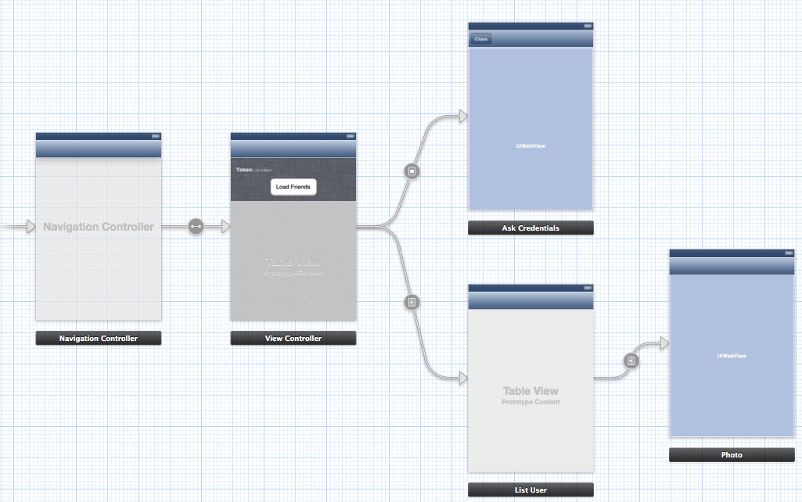

In chapter 3 we learned how to read a structured file from Internet and use information contents on it to fill our application. Ok, that’s right, but you need to create these files and put in yourself server. What would you think if I tell you that you can catch a lot information from your favourite social network without too effort? On this chapter we’ll learn how to develop an application that is filled with data from services from Internet alien to us.  
  
On the first part of the chapter you’ll consume *free information*, without need of introduce any user or password, on this case from GitHub.  
  
Second part of the chapter is about OAuth, an open login protocol that allows you to get information related with your specific user; in this case we’ll use 
Instagram API to load friend list and their photos.  
  
The main point that I would like to emphasize along this chapter is that all these information is out there, and you can get and represent it, as you like to make your application over these APIs.

## 4.1 Using free APIs  
Free APIs are a subset that is distinguished by doesn’t need to have a user and password to get their information. For example, to do a search on Google, you can be logged with your Gmail account, but you also can do it as ‘anonymous user’ and Google retrieve you results to your search. The same thing happens with APIs, some requests can be done freely.

### 4.1.1 But… What the hell is an API?  
Maybe I should have started here. API is acronym of *Application Programming Interface* and in summary is a “language” provided by a specific service to communicate with, and allows for example to do requests about users, likes or whatever which has been implemented by the API service.  
  
A lot of APIs are available on Internet to get their information without to be login on these platforms. A good illustration is Twitter API, where it’s possible to make a query and it retrieves a list of twits that include a specific word, for example to follow an event.  
  
Also it’s possible to do things related with your personal account, as write a twit, but for this you need to be logged, and we’ll explain it in the last section of this chapter.

### 4.1.2 First steps with GitHub API  
Usually APIs have a good documentation that explain how it works, so it’s very recommended read it before start to write the first line of code and understand what things you can to do with it.  
  
In our case, we’ll use GitHub API, so on first place we need to go to [http://developer.github.com/](http://developer.github.com/) where we can found several pages about all the things that you are allowed to do.  
  
Our application will show user’s repositories and their friends, so we need to pay special attention to user’s section ([http://developer.github.com/v3/users/](http://developer.github.com/v3/users/)), because we’ll use these queries:  
  
* `users/%@/repos`  
* `users/%@/followers`  
* `users/%@/following`  
  
You can test what returns each url for understand better this chapter, for example, you could want to see my repositories, so you could open in your favorite browser this URL:
[https://api.github.com/users/patoroco/repos](https://api.github.com/users/patoroco/repos).  
  
As you saw, the answer is returned in JSON format, so it’s easy of read each part on it, and understand what field is from the key name.  
  
Once we have understand how API’s runs, we going to create the skeleton of the app where show interesting information.

### 4.1.3 Skeleton of GitApp  
In this case we going to create a multi viewcontroller application, so I prefer to use storyboard for it. This is the final aspect that you would accomplish if you follow this chapter.  
  
  
  
As you can see, application is built with a navigation controller, where root view controller shows a text field to introduce a GitHub nickname and pressing load, it will do a request to GitHub API returning all specific values to fill this screen.  
  
After that, user could select see user repositories, people who is followed by this user or people that is following the user.  
  
Finally, we’ll use GitHub URL included on response to show webpage of each to the user.  
  
As we did before, we need to include AFNetworking in our project, so one more time I chosen the easiest method: CocoaPods. If you have some dudes, go back and reread this section.

### 4.1.4 GitApp Client  
AFNetworking includes several classes that help with ordinary tasks. One of these is `AFHTTPClient` that include common patterns of communicating with an API, for example making requests using relative paths or setting HTTP headers which will be sent for each request.  
  
Typically, you will not work with AFHTTPClient directly, but you’ll do a subclass of it, where you define a singleton with a base URL and all request will be done to this base path followed of the relative URL.  
  
On XCode create a new class named GitHubAPIClient that has AFHTTPClient as superclass, and define a public class method as follows.  
  
```obj-c  
@interface JMGitHubAPIClient : AFHTTPClient  
+ (JMGitHubAPIClient *)sharedClient;  
@end  
```  
  
On implementation section is useful to write a constructor from a URL as follows.  
  
```obj-c  
- (id)initWithBaseURL:(NSURL *)url {  
	self = [super initWithBaseURL:url];  
	if (!self) return nil;  

	[self registerHTTPOperationClass:[AFJSONRequestOperation class]];  
	[self setDefaultHeader:@"Accept" value:@"application/json"];  
	return self;  
}  
```  
  
As you can see, here you define what is default header that you want to receive in all responses. This is recommendable because some APIs allow you to receive responses on different formats, for example JSON or XML, so it’s important that you choose one of these.  
  
At last, you only need to do a singleton as is usual, and calls to the constructor with the base URL that will be used on all client (this property is read-only, so if you need to do requests to different APIs, you need to write one APIClient by each service) as the code below.  
  
```obj-c  
static NSString * const kAFGitHubAPIBaseURLString = @"https://api.github.com/";  
  
+ (JMGitHubAPIClient *)sharedClient {  
    static JMGitHubAPIClient *_sharedClient = nil;  
    static dispatch_once_t onceToken;  
    dispatch_once(&onceToken, ^{  
        _sharedClient = [[JMGitHubAPIClient alloc] initWithBaseURL:[NSURL URLWithString:kAFGitHubAPIBaseURLString]];  
    });  
  
    return _sharedClient;  
}  
```

### 4.1.5 User info  
  
Main screen shows some information about user whit the nickname filled on text field, as user avatar, real name or number of friends of this user as you can see on image below.  
  
  
  
First of all, we need to define some outlets to update these interface elements, as follows:  
  
```obj-c  
@interface JMViewController ()  
	@property (weak, nonatomic) IBOutlet UITextField *nickname;  
	@property (weak, nonatomic) IBOutlet UIImageView *avatar;  
	@property (weak, nonatomic) IBOutlet UILabel *name;  
	@property (weak, nonatomic) IBOutlet UILabel *company;  
	@property (weak, nonatomic) IBOutlet UILabel *location;  
	@property (weak, nonatomic) IBOutlet UIButton *reposButton;  
	@property (weak, nonatomic) IBOutlet UIButton *followersButton;  
	@property (weak, nonatomic) IBOutlet UIButton *followingButton;  
@end  
```  
  
After that we need to include an IBAction which will be called when load button will be pressed and will start the API request.  
  
```obj-c  
- (IBAction)loadUser {  
	NSString *urlWithUser = [NSString stringWithFormat:@"users/%@", self.nickname.text];  
	
	[[JMGitHubAPIClient sharedClient]  
		getPath:urlWithUser  
		parameters:nil  
		success:^(AFHTTPRequestOperation *operation, id responseObject) {  
			[self loadInfo:responseObject];  
		} failure:^(AFHTTPRequestOperation *operation, NSError *error) {  
			NSLog(@"Error:\n%@", error.localizedDescription);  
		}
	];  
}  
```  
  
As you can see, here we are using our `AFHTTPClient subclass`, adding relative path to specify what we want to do, in this case we are calling to *users/&lt;nickname&gt;* to get information relative to this user.  
  
On success we call to `loadInfo` method that is responsible to manage all information and include it in our labels, buttons or whatever as follows.  
  
```obj-c  
-(void)loadInfo:(NSDictionary *)responseDict{  
	[self.avatar setImageWithURL:[NSURL URLWithString:responseDict[@"avatar_url"]]];  
	self.name.text = responseDict[@"name"];  
	self.company.text = responseDict[@"company"];  
	self.location.text = responseDict[@"location"];  

	NSString *repoStr = [NSString stringWithFormat:@"%@", responseDict[@"public_repos"]];  
	NSString *followingStr = [NSString stringWithFormat:@"%@", responseDict[@"following"]];  
	NSString *followersStr = [NSString stringWithFormat:@"%@", responseDict[@"followers"]];  

	[self.reposButton setTitle:repoStr forState:UIControlStateNormal];  
	[self.followingButton setTitle:followingStr forState:UIControlStateNormal];  
	[self.followersButton setTitle:followersStr forState:UIControlStateNormal];  
}
```  
 
As you can see, **JSON** is converted to an `NSDictionary`, so it’s easy to access to every key value, so one more time my advice is that open the full JSON in your favourite text editor and select fields that you need to show on the screen.  
  
Finally we need to include IBOutlets for each button that will load follower users, following users and repositories and prepareSegue for the next view controller that depends of the name of the user.  
  
```obj-c  
- (IBAction)loadRepos {  
    [self performSegueWithIdentifier:kRepoSegue sender:self];  
}  
- (IBAction)loadFollowers {  
    [self performSegueWithIdentifier:kFollowersSegue sender:self];  
}  
- (IBAction)loadFollowing {  
    [self performSegueWithIdentifier:kFollowingSegue sender:self];  
}  
  
-(void)prepareForSegue:(UIStoryboardSegue *)segue sender:(id)sender{  
    if ([segue.identifier isEqualToString:kRepoSegue]){  
        JMRepoList *repoList = segue.destinationViewController;  
        repoList.title = @"Repositories";  
        repoList.nickname = self.nickname.text;  
    }else if ([segue.identifier isEqualToString:kFollowersSegue]){  
        JMFollowersList *followersList = segue.destinationViewController;  
        followersList.title = @"Followers";  
        followersList.nickname = self.nickname.text;  
    }else if([segue.identifier isEqualToString:kFollowingSegue]){  
        JMFollowingList *followingList = segue.destinationViewController;  
        followingList.title = @"Following";  
        followingList.nickname = self.nickname.text;  
    }  
}  
```

### 4.1.6 Repositories, followers and following  
Next three screens are very similar (being honest, maybe I should share same viewController), so I prefer explain it together.  
  
The main point is show a list of info (repos, followers or followings) related with an user, doing a request to different paths as will explain after. Final result should be similar to below image, so take your time to understand and recreate it with Interface Builder.  
  
  
  
As I told before, lists get their info from different URLs that are:  
  
* users/%@/repos  
* users/%@/followers  
* users/%@/following  
  
We’ll explain in depth followers screen because it’s the most complete (includes image loads), but remember that all source code is available on GitHub, so feel free to use as reference too.  
  
On first place, we need to define two properties, one to save nickname (it’s set from main screen) and another one to store array of followers:  
  
```obj-c  
@interface JMFollowersList : UITableViewController  
	@property (nonatomic, strong) NSString *nickname;  
	@property (nonatomic, retain) NSArray *followers;  
@end  
```  
  
Now in viewDidLoad method do a request to followers relative URL using our APIClient as follows:  
  
```obj-c  
-(void)viewDidLoad{  
    …  
    NSString *path = [NSString stringWithFormat:@"users/%@/followers", self.nickname];  
      
    [[JMGitHubAPIClient sharedClient]  
     getPath:path  
     parameters:nil  
     success:^(AFHTTPRequestOperation *operation, id responseObject) {  
           
         self.followers = responseObject;  
         [self.tableView reloadData];  
           
     } failure:^(AFHTTPRequestOperation *operation, NSError *error) {  
         NSLog(@"ERROR: %@", error.localizedDescription);  
     }];  
}  
```
  
As you can see, that’s trivial: you only do a GET request to specific path, and when success copy JSON results in your array and reload table, so delegate methods will be called:  
  
```obj-c  
#pragma mark - Table Delegates  
-(NSInteger)tableView:(UITableView *)tableView numberOfRowsInSection:(NSInteger)section{  
	return self.followers.count;  
}  
  
- (UITableViewCell *)tableView:(UITableView *)tableView cellForRowAtIndexPath:(NSIndexPath *)indexPath{  
	static NSString *CellIdentifier = @"Identifier";  
  
	UITableViewCell *cell = [tableView dequeueReusableCellWithIdentifier:CellIdentifier];  
  
	if (!cell){  
		cell = [[UITableViewCell alloc] initWithStyle:UITableViewCellStyleSubtitle reuseIdentifier:CellIdentifier];  
	}  
  
	NSDictionary *followersDict = [self.followers objectAtIndex:indexPath.row];  
	[cell.imageView  
		setImageWithURL:[NSURL URLWithString:followersDict[@"avatar_url"]]  
		placeholderImage:[UIImage imageNamed:@"icon.png"]];  
		cell.textLabel.text = followersDict[@"login"];  
		cell.detailTextLabel.text = followersDict[@"html_url"];  
	return cell;  
}  
```  
  
Here you load all info in your cells as is usual, and use UIImageView category included in AFNetworking to load UIImageView easily.  
  
Finally, we’ll create another viewController that only includes a webView, which is loaded with URL (friend GitHub profile in this case) as follows:  
  
```obj-c  
-(void)tableView:(UITableView *)tableView didSelectRowAtIndexPath:(NSIndexPath *)indexPath{  
    [self performSegueWithIdentifier:kWebSegue sender:self];  
}  
  
-(void)prepareForSegue:(UIStoryboardSegue *)segue sender:(id)sender{  
    JMWebView *webView = segue.destinationViewController;  
      
	NSDictionary *followersDict = [self.followers objectAtIndex:self.tableView.indexPathForSelectedRow.row];  
    webView.url = followersDict[@"html_url"];  
}  
```  
  
That’s all; the other two screens are the same thing changing URL of request and fields names gotten from JSON.

## 4.2 Authenticated APIs  
First part of this chapter explained how to consume a public API, but sometimes you need to be logged to ask to this API specific information, for example what messages you have on your Facebook inbox or your last checking on Foursquare.  
  
Login could be one of the most difficult things to do on API management, but fortunately time ago appears some standards protocols to this purpose, one of these is OAuth that has different versions.  
  
On this second part of this chapter, we’ll create a mini client for Instagram social network, where we’ll see a list of our friends and inside of each one, a list of their photos with filter names.


### 4.2.1 Register application  
  
Because we’ll need to log in from our application, first step is request permission to Instagram about our application, so go to [http://instagram.com/developer/](http://instagram.com/developer/) and click on Register Your Application, where you should see a screen as image below:  
  
  
  
Mainly you need to set the name and the description for your application, website, and finally, a redirect URL that will be called after user log in or when access.  
  
For example, when user log in correctly with InstAFN he will be redirect to [http://tactilapp.com/#access_token=&lt;user_token&gt;](http://tactilapp.com/#access_token=&lt;user_token&gt;), so we’ll catch these token to use on the user session, but we’ll explain it later.

### 4.2.2 Skeleton of InstAFN  
  
This time we’ll use also storyboard to simplify app flow, in this case we have a main view controller with a table inside of it where we’ll show our Instagram fiends, and where user click on one cell, we’ll show all his photos on another table together used filters. Finally, if user clicks one photo, application loads a web view with Instagram webpage for this. You can take image below as guide if you want.  
  
  
  
Maybe now you are asking about ‘Ask Credentials’ view controller, but don’t worry, I didn’t forget it, it’s just I’ll explain it on next subsection. Go ahead!

### 4.2.3 Login with OAuth2  
  
Instagram implements *OAuth2*  as authentication system, so first of all we need to ask about a token which will be send on all requests to API if we want to be known as authenticated users.  
  
For this example we’ll define a public property on our AppDelegate where we store our token once loged in as follows.  
  
```obj-c  
@property (nonatomic, strong) NSString *token;  
```  
  
After that we need to create another view controller which will be called always that user try to do any authenticated task without be log in, this is the `Ask Credentials` controller that you see on storyboard figure.  
  
For this purpose, we need to do an authorize request to Instagram oauth server, passing as parameters our client id (you can found it on your Instagram application page) and callback URL (it needs to be the same which you fill on your application page) as follows:  
  
```obj-c  
NSString * const kClientID = @"f68621ad1bd44bbf90818fe6851644cb";  
NSString * const kCallbackURL = @"tactilapp.com";  
  
@interface JMAskCredentials()  
	@property (weak, nonatomic) IBOutlet UIWebView *web;  
@end  
  
@implementation JMAskCredentials  
-(void)viewDidLoad{  
	NSString *oauthURL = @"https://api.instagram.com/oauth/authorize";  
  
	NSString *authURL = [NSString stringWithFormat:@"%@/?client_id=%@&redirect_uri=http://%@&response_type=token", oauthURL, kClientID, kCallbackURL];  
  
	NSURLRequest *req = [NSURLRequest requestWithURL:[NSURL URLWithString:authURL]];  
  
	[self.web loadRequest:req];  
}  
```  
  
This request will retrieve a webpage where user needs to fill his username and password, and if all is correct, allow to our application to access to his basic information as shown in image below.  
  
  
  
When user log in correctly and allow us to access his data, web view will be redirect to our callback URL followed of the access token if all was ok, or with error messages if any failed.  
  
Is for this that we need to watch over all requests in web view using a delegate method of the web view controller. If we found any string with ‘access_token’ in, we set this to AppDelegate property and close this view controller.  
  
```obj-c  
-(BOOL)webView:(UIWebView *)webView shouldStartLoadWithRequest:(NSURLRequest *)request navigationType:(UIWebViewNavigationType)navigationType{  
	if ([request.URL.host isEqualToString:kCallbackURL]  
		&& request.URL.fragment){  
		  
		NSString *anchor = request.URL.fragment;  
		NSRange range = [anchor rangeOfString:@"access_token="];  
  
		if (range.length != 0){  
			NSString *token = [anchor substringFromIndex:range.location + range.length];  
			JMAppDelegate *delegate = [[UIApplication sharedApplication] delegate];  
			delegate.token = token;  
			[self close:self];  
  
			return NO;  
		}  
	}  
	return YES;  
}  
```  
  
At this moment, we’ve stored token, so from now we can add it to our request and we’ll be registered user facing to Instagram.

### 4.2.4 Instagram API Client  
  
As we did on first part of this chapter, we need to subclass `AFHTTPClient` to configure all our requests from now. Procedure is almost the same that in the first part, changing URL to requests to [https://api.instagram.com/v1/](https://api.instagram.com/v1/), but the novelty is that we need to add token on all requests, so we going to override getPath implementation as follows:  
  
```obj-c  
-(void)getPath:(NSString *)path parameters:(NSDictionary *)parameters  
	success:(void (^)(AFHTTPRequestOperation *, id))success  
	failure:(void (^)(AFHTTPRequestOperation *, NSError *))failure{  
  
	NSMutableDictionary *param = [NSMutableDictionary dictionary];  
  
	JMAppDelegate *delegate = [[UIApplication sharedApplication] delegate];  
  
	if (delegate.token)  
		[param setValue:delegate.token forKey:@"access_token"];  
  
	[super getPath:path parameters:param success:success failure:failure];  
}   
```  
  
From now, all getPath requests will be authenticated by default, so we can start to shoot screens!

### 4.2.5 Load friends of logged user  

On first screen we’ll include a button to reload friend list. This button monitors the token, and while it doesn’t exist will show credentials screen where user need to log in to continue. When you finish this example, you’ll have some like image below.  
  
  
  
When user has a token, app will do a request using InstagramAPIClient to get friend followers because token is being sent so user is authenticated for Instagram. Code is very similar to that seen in previous chapters as follows, but remember that APIClient is working for you adding token in each request.  
  
```obj-c  
- (IBAction)loadFriends:(id)sender {  
	JMAppDelegate *delegate = [[UIApplication sharedApplication] delegate];  
  
	if (!delegate.token){  
		[self performSegueWithIdentifier:@"askCredencials" sender:self];  
	}else{  
		[[JMInstagramAPIClient sharedClient]  
			getPath:@"users/self/followed-by"  
			parameters:nil  
			success:^(AFHTTPRequestOperation *operation, id responseObject) {  
				self.following = responseObject[@"data"];  
				[self.table reloadData];  
			} failure:^(AFHTTPRequestOperation *operation, NSError *error) {  
				NSLog(@"%@", error);  
			}  
		];  
	}  
}  
```

### 4.2.6 Friend’s photos  
When a user is selected between user’s friend list, a new view controller will load all his photos and which filter he used. For this purpose is important to define a property with id of the user because Instagram API will require it, and after that load info as follows.  
  
```obj-c  
-(void)viewDidLoad{  
	[super viewDidLoad];  
	NSString *path = [NSString stringWithFormat:@"users/%@/media/recent", self.idUser];  
	  
	[JMInstagramAPIClient sharedClient] getPath:path  
		parameters:nil  
		success:^(AFHTTPRequestOperation *operation, id responseObject) {  
			self.photos = responseObject[@"data"];  
			[self.table reloadData];  
	} failure:^(AFHTTPRequestOperation *operation, NSError *error) {  
		NSLog(@"%@", error.localizedDescription);  
	}];  
}  
```  
  
As you can see, we always repeat some structure here: request info, load in an array and reload table to show info on screen. Really you should add more stuff to make a killer application, but with respect to consume an API that’s enough to have a final screen as image below.  
  
  
  
On right image above, you see Instagram photo loaded in a web view. You could have load only image into a UIImageView, or animate while you show up, imagination is your limit!

## 4.3 Summary  
In this chapter we learned how to consume a public API (GitHub) and we have seen all possibilities that gives as developers: you can enrich your application using information of different services.  
  
Sometimes it’s necessary to be logged in these services (social networks for example), so on second part of the chapter we saw how to log in from our application to Instagram and do things relative to this user, for example see a list of friend photos.  
  
In the next chapter we will fight with these pages, which don’t provide us a public API, so we need to scraping the content.

