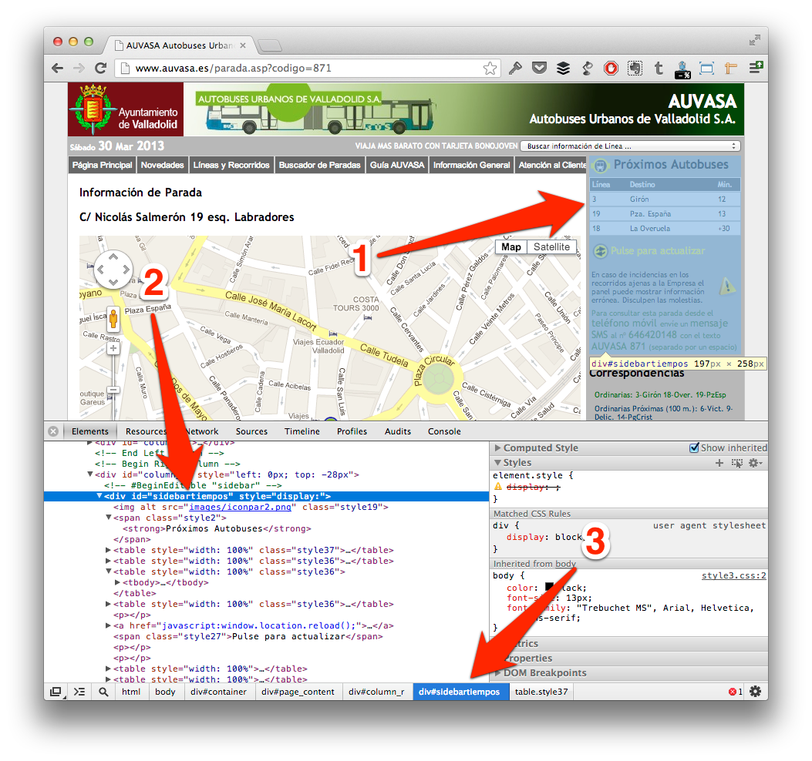
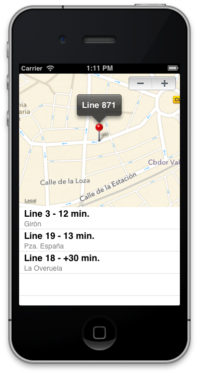

In the last chapter you learned how to use information of some webpages, which give you an API to consume this easily. That’s really nice, but maybe you want to use information from specific website, but it doesn’t have a public API.  
  
This chapter will explain how to catch information from any website (this technique is named *scrapping*) to use in your app, maybe to complete some services that you are paying, or simply to create a front-end for a no-mobile web which will be easy of use on a mobile device.  
  
We’ll develop an application to show how much longer are different bus lines using information that company publishes on his website, but which are difficult to understand using an iPhone for example.

## 5.1 Develop applications != create yourself content  
  
Until last chapter, you might have thought that all information showed in an application should be created and maintained by app creator, but that’s not all true.  
  
If you are familiar with blogs, you should know a standard very linked with it, named RSS (*Really Simple Syndication*), which is a subset of XML. Mainly these files can be accessed from a browser, but the main advantage of RSS is to be included in a feeds reader, where you’ll be notified when one of your favorite blogs has been updated without being visiting one by one all these favorite blogs.  
  
RSS is a good example of how you can include information from several parts in your application, and really you can do that with your current knowledge (remember that RSS is a XML file, and you can read different parts using AFNetworking subclass for XML).  
  
That’s chapter goes beyond, and we’ll try to use information contented in a real-website, reading his HTML source, which usually is not well formed from the standpoint of XML. To understand how it works, we’ll do an example of web scrapping and we’ll show information on an iOS application.

## 5.2 What is our target?  
  
Some bus companies have screens on bus stops to show how long until the next bus arrives, would not it be interesting to check this time from your house instead on wait on bus stop? Fortunately some companies publish these times on their websites, so go ahead and make an application to help users in their life!  
  
In this case we’ll use AUVASA (Valladolid, Spain) webpage to get time information, but I invite you to do the same with your city company and share with us!  
  
Ok, go with your browser to [http://www.auvasa.es/](http://www.auvasa.es/), and you can see a form on the middle of the page to enter a line number, for example 871.  
  
When you hit enter, you will be redirect to [http://www.auvasa.es/parada.asp?codigo=871](http://www.auvasa.es/parada.asp?codigo=871), you can see that URL is of the form [http://www.auvasa.es/parada.asp?codigo=&lt;stop_number&gt;](http://www.auvasa.es/parada.asp?codigo=&lt;stop_number&gt;), that’s important to the rest of the application, so we’ll define URL as a constant after.

### 5.2.1 Navigate in the structure  
  
When you visit this page, you can see a map on the left to represent where is the stop, and how far to the next bus on the right. We’ll catch these information form our application to show it friendlier on our application.  
  
First of all, I recommend to inspect how is built the website, because after we’ll use a parser to catch these information (and no more), so we need to specify ‘queries’ to the parser. Exist several tools for to do that (Safari Inspector, Firebug for Firefox…), but I like Google Chrome, so we’ll use his web inspector here.  
  
On Google Chrome, you can go to menu View `| Developer | Developer` Tools or press `Cmd + Alt + I`, and you should see any similar to image below.  
  
  
  
If you press on lens icon at the bottom of Chrome, and after select specific website area (this will be grayed, as point 1), you’ll see HTML code which it is (point 2). Point 3 notes HTML hierarchy composed by class and ids, as like different elements which embedded current element.  
  
This notation should be familiar to you if you were working with jQuery or CSS for example, if not, take patience to understand which one is inside of which other.  
  
In this case, you can see that important information is inside of a `div` with id `sidebartiempos`, and after that, each line is a different table with class `style36` that contents three td, first correspond to line number, second is the name and third is the time until bus arrives.  
  
In conclusion, we’ll do queries about #sidebartiempos table.style36 and iterate over td contented in each one to catch different values.  
  
Also we’ll catch coordinates from Google Maps to include a map in our application. For that we’ll search different `<script>` in the source code, and using regular expressions will find longitude and latitude. Don’t worry if this confuses you at this moment, that’s easier when you code with it.

## 5.3 Skeleton of our application  
  
At this time, we’ll work with a single view application compounds by a mapview and a table view, as well as an stepper which will enable us to change between bus stops. Final view should be similar to image below.  
  
  
  
Don’t forget to connect these components with IBOutlets, and define another NSArray property to store arrivals (we will create this class after) as follows:  
  
```obj-c  
#define uBUS @”http://www.auvasa.es/parada.asp”  
  
@interface JMViewController (){  
	int lineNumber;  
}  
  
@property (weak, nonatomic) IBOutlet MKMapView *map;  
@property (weak, nonatomic) IBOutlet UITableView *table;  
@property (weak, nonatomic) IBOutlet UIStepper *stepper;  
@property (nonatomic,strong) NSMutableArray *arrivals;  
@end  
```  
  
You can see a variable named lineNumber that will store which line is selected, to show information about it on screen.

### 5.3.1 Podfile  
  
As is usual, we’ll use Cocoa Pods to install third party libraries, and in this case we need to include on Podfile ElementParser and MKMapViewZoom besides AFNetworking as follows:  

```yaml  
platform :ios, '6.0'  
pod 'AFNetworking', '1.0'  
pod 'ElementParser', '0.0.1'  
pod 'MKMapViewZoom', '1.0'  
```  

**ElementParser** ([http://touchtank.wordpress.com/element-parser/](http://touchtank.wordpress.com/element-parser/)) is the parser which we’ll use. I choose this one because it supports queries using CSS identifiers, and it doesn’t require a well-formed XML, so it’s perfect to parse real-world websites, because other parsers crash when XML is not perfectly formed.  
  
**MKMapViewZoom** ([http://troybrant.net/blog/2010/01/set-the-zoom-level-of-an-mkmapview/](http://troybrant.net/blog/2010/01/set-the-zoom-level-of-an-mkmapview/)) is a helper to manage zoom level similarly as Google does instead of change manually viewport region.  
  
After edit Podfile, don’t forget to execute pod install and open workspace instead of XCode project.

### 5.3.2 Load HTML  

First of all we need to make a request to get HTML source from AUVASA website, so as you learned in past chapters, create URL string append lineNumber to base path, and create an AFHTTPRequestOperation. When it successes, be careful when you convert to a NSString, because at this time codification is different (you can see which one it is using Chrome), so instead of use `UTF8` encoding, use `NSASCIIStringEncoding` as follows.  
  
```obj-c  
-(void)loadBusLine:(int)line{  
	lineNumber = line;  
  
	NSString *urlLine = [NSString stringWithFormat:@"%@?codigo=%i",uBUS, lineNumber];  
  
	NSURL *url = [NSURL URLWithString:urlLine];  
	NSURLRequest *req = [NSURLRequest requestWithURL:url];  
  
	AFHTTPRequestOperation *op = [[AFHTTPRequestOperation alloc] initWithRequest:req];  
  
	[op  
		setCompletionBlockWithSuccess:^(AFHTTPRequestOperation *operation, id responseObject) {  
			NSString *html = [[NSString alloc] initWithData:operation.responseData encoding:NSASCIIStringEncoding];  
			[self parse:html line:lineNumber];  
		} failure:^(AFHTTPRequestOperation *operation, NSError *error) {  
			NSLog(@"ERROR: %@", error.localizedDescription);  
	}];  
  
	[op start];  
}  
```  
  
To make code more readable, I send HTML string to another method which will get necessary information and manage it to load on the table.

### 5.3.3 Scrapping time schedule  
  
First of all, we need to create a specific class to store required information about arrivals. This will be simply a set of properties (line, name and time) that will be stored inside of an array as after.  
  
```obj-c  
@interface JMArrival : NSObject  
	@property (nonatomic, strong) NSString *line;  
	@property (nonatomic, strong) NSString *name;  
	@property (nonatomic, strong) NSString *time;  
@end  
```  
  
Parse method will use Element Parser library to find important information using ‘jQuery notation’ as follows:  
  
```obj-c  
-(void)parse:(NSString *)html line:(int)line{  
	self.arrivals = [NSMutableArray array];  
  
	DocumentRoot *document = [Element parseHTML:html];  
  
	NSArray *elements = [document selectElements:@"#sidebartiempos table.style36"];  
  
	for (Element *element in elements){  
		NSArray *busElements = [element selectElements:@"td"];  
  
		JMArrival *arrivalTmp = [[JMArrival alloc] init];  
		arrivalTmp.line = ((Element *)busElements[0]).contentsText;  
		arrivalTmp.name = ((Element *)busElements[1]).contentsText;  
		arrivalTmp.time = ((Element *)busElements[2]).contentsText;  
  
		[self.arrivals addObject:arrivalTmp];  
	}  
  
	[self.table reloadData];  
}  
```  
  
First of all we’ve created a `DocumentRoot` which store all `DOM` of our `HTML` file. After, we make a query to search all table elements with class style36 and that are contained on an element with id `sidebartiempos`. We iterate each result looking for td elements (corresponds with each column on the table), and set first element to line number, second element with line name and third with time until arrive of these line.  
  
Remember that these routes were founded using Chrome Inspector, so feel free to choose another one in your ‘scrapping project’.  
  
Finally we need to set up table delegate methods as follows:  
  
```obj-c  
#pragma mark - Table Delegates  
-(NSInteger)tableView:(UITableView *)tableView numberOfRowsInSection:(NSInteger)section{  
	return self.arrivals.count;  
}  
  
- (UITableViewCell *)tableView:(UITableView *)tableView cellForRowAtIndexPath:(NSIndexPath *)indexPath{  
	static NSString *CellIdentifier = @"Identifier";  
  
	UITableViewCell *cell = [tableView dequeueReusableCellWithIdentifier:CellIdentifier];  
  
	if (!cell){  
		cell = [[UITableViewCell alloc] initWithStyle:UITableViewCellStyleSubtitle reuseIdentifier:CellIdentifier];  
	}  
  
	JMArrival *arrival = self.arrivals[indexPath.row];  
	cell.textLabel.text = [NSString stringWithFormat:@"Line %@ - %@ min.", arrival.line, arrival.time];  
	cell.detailTextLabel.text = arrival.name;  
  
	return cell;  
}  
```  

Basically is the same that in other occasions: get element on array and represent values in each cell on table view. Here we represent line number and time as title, and name of the line as description.


### 5.3.4 Get map position  
  
As an extra pill, we want to represent each line in a map, impossible is nothing!  
  
If you inspect one more time HTML source, you can see several JS scripts, but at last appears one which configure map view on website, and where you should see any similar to follows:  
  
```obj-c  
var myLatlng = new google.maps.LatLng("41.646089", "-4.720144");  
```  
  
We will use MapKit to show a map on our application, so we only need longitude and latitude from these line. Is for this that we need to add some lines to parse method to catch these values from HTML as you can see at code below:  
  
```obj-c  
-(void)parse:(NSString *)html line:(int)line{  
	…  
	NSArray *scripts = [document selectElements:@"script"];  
	for (Element *script in scripts){  
		NSString *scriptSource = ((Element *)script).contentsText;  
  
		if ([scriptSource rangeOfString:@"var myLatlng"].location != NSNotFound){  
			[self getCoordinates:scriptSource line:line];  
		}  
	}  
}  
```  
  
First of all, we search different scripts sections in all HTML file, and look for `var myLatlng` string, in which case we call to another method, which we implement in a few minutes.  
  
Before that, we going to create a category to help us to clean strings and a class which conforms MKAnnotation protocol to show pins on map with information about line.  
  
```obj-c  
@implementation NSString (AFNetworking)  
-(NSString *)removeString:(NSString *)str{  
	return [self stringByReplacingOccurrencesOfString:str withString:@""];  
}  
@end  
```  
  
This method only receives a substring that we want to remove from a string, and return this string without it.  
  
```obj-c  
@interface JMAnnotation : NSObject<MKAnnotation>  
@property (nonatomic, readonly) CLLocationCoordinate2D coordinate;  
@property (nonatomic, assign) int line;  
  
- (id) initWithCoordinate:(CLLocationCoordinate2D)coord line:(int)line;  
@end  
```  
  
JMAnnotation include a coordinate and a line number which will be show on a bubble when user press the pin. Implementation is too easy as you can see below:  
  
```obj-c  
@implementation JMAnnotation  
- (id) initWithCoordinate:(CLLocationCoordinate2D)coord line:(int)line{  
	self = [super init];  
	if (!self) return nil;  
 
	_line = line;  
	_coordinate = coord;  
 
	return self;  
}  
  
-(NSString *)title{  
	return [NSString stringWithFormat:@"Line %i", self.line];  
}  
@end  
```  
  
Once we have that, we can implement method to get coordinates from javascript script, and which will create a JMAnnotation with these coordinates and add it to the map as follows:  
  
```obj-c  
-(void)getCoordinates:(NSString *)scriptSource line:(int)line{  
	NSError *error;  
	NSRegularExpression *regex = [NSRegularExpression  
		regularExpressionWithPattern:@"google.maps.LatLng(.*);"  
		options:0 error:&error];  
	if (regex != nil) {  
		NSTextCheckingResult *firstMatch = [regex firstMatchInString:scriptSource  
			options:0 range:NSMakeRange(0, [scriptSource length])];  
  
		if (firstMatch) {  
			NSRange accessTokenRange = [firstMatch rangeAtIndex:1];  
			NSString *accessToken = [scriptSource substringWithRange:accessTokenRange];  
			accessToken = [accessToken stringByReplacingPercentEscapesUsingEncoding:NSUTF8StringEncoding];  
  
			accessToken = [accessToken removeString:@"\""];  
			accessToken = [accessToken removeString:@"("];  
			accessToken = [accessToken removeString:@")"];  
  
			NSArray *listItems = [accessToken componentsSeparatedByString:@", "];  
			CLLocationDegrees lon = [listItems[0] floatValue];  
			CLLocationDegrees lat = [listItems[1] floatValue];  
			CLLocationCoordinate2D coordinate = CLLocationCoordinate2DMake(lon, lat);  
  
			JAnnotation *annotation = [[JMAnnotation alloc] initWithCoordinate:coordinate line:line];  
			[self.map addAnnotation:annotation];  
			[self.map setCenterCoordinate:coordinate zoomLevel:15 animated:YES];  
		}  
	}  
}  
```  
  
If you are an expert of regular expressions, maybe you can improve this source, but I prefer to do this simple to help understanding. Instead, if you are a newbie of that, maybe this code scary you, but take your time to analyze it and you’ll see that this is very long, but bit complicated: only search by a `google.maps.LatLng(<whatever>);` string, and when found it, clean values in to use it on `JMAnnotation` object.  
  
After that, add annotation to the map and center the map using MKMapView category which will zoom animatedly to this point.

### 5.3.5 Load different lines  
  
Finally, you only need to call the `loadBusLine` method at load application and always that user press stepper to change between line numbers as follows:  
  
```obj-c  
- (void)viewDidLoad{  
	[super viewDidLoad];  
	[self loadBusLine:(int)self.stepper.value];  
}  
- (IBAction)valueChanged:(UIStepper *)sender {  
	[self loadBusLine:(int)sender.value];  
}  
```  
  
If you press `Run` button, you should see any like the image below. You can change bus stops with stepper, and you’ll see arrivals to each stop.  
  


## 5.4 Summary  
  
This chapter should serve as base to create several applications reusing information available on different websites.  
  
We’ve learned how to do that across an example with a bus company which publishes their bus stop arrivals on his website, but access to this information from an iPhone with his small screen is too difficult, so we’ve created an application that catch these information and show on more clearly.  
  
Now think about how much possibilities enables that knowledge, because you can mix information of several websites with public APIs and create a very complete application without need of develop yourself backend.  
  
On the next chapter we’ll learn about migrate from an old library similar to AFNetworking which was very used also, but that was deprecated months ago.

