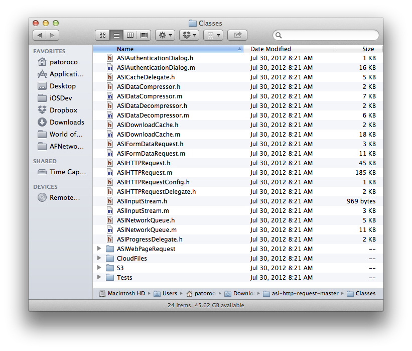

In chapter 2 we showed how difficult is to manage several request at the same time using SDK included classes (`NSURLRequest`, `NSOperation`, etc.), because that some libraries started to grow up trying to encapsulate this task and facilitate developer’s work when he need to fight with complicated APIs for example.  
  
One of the most popular libraries was `ASIHTTPRequest`, created by Ben Copsey (*@pokeb*), which has been starred almost 4.500 times on Github, demonstrating that was very followed by developers who included it in their iOS projects.  
  
Problems came when his author decided don’t continue with his development and improvement, so several libraries born trying to continue his legacy, and as you can think now, AFNetworking was one of the winners on this combat to popularity. Developers who loved `ASIHTTPRequest` had a difficult decision in front of there: continue using a deprecated library or migrate to the new and improved `AFNetworking`.  
  
To help on this change it was created another library (truly a category of `AFNetworking`), named `AFNetworking-ASIHTTPRequest`, that as you are thinking allows you to use AFNetworking in an old ASI-project without take care about nothing.  
  
This chapter will show you how worked `ASIHTTPRequest`, and how to make a first migration to AFNetworking in only some minutes.

## 6.1 Creating a sample project with ASIHTTPRequest  

We think that the best form to learn is doing, so we going to recreate application that we developed on chapter 2 which simply consumed a string and show on a webview, but at this time we going to use `ASIHTTPRequest` to understand how it runs.

### 6.1.1 Downloading and including ASIHTTPRequest in our project  

First that we need to do is going to `ASIHTTPRequest` project webpage ([http://allseeing-i.com/ASIHTTPRequest/](http://allseeing-i.com/ASIHTTPRequest/)) and download and unzip the code to our computer as see in the following figure.  
  
  
  
You need to include all these files in your project, and if your project is to iOS, also need to add Reachability and `ASIAuthenticationDialog` classes. Anyway, if you are unsure of which files you need to include specifically, you have a complete list of them on [http://allseeing-i.com/ASIHTTPRequest/Setup-instructions](http://allseeing-i.com/ASIHTTPRequest/Setup-instructions).  
  
After that you need to include several frameworks to run an `ASIHTTPRequest` project:  
  
* CFNetwork  
* SystemConfiguration  
* MobileCoreServices  
* CoreGraphics  
* libz  
  
Because you probably are in an ARC compatible project, you need to add some `-fno-objc-arc` flags to your compiler, because these were created without ARC. To do that, open your project file, and in `Build Phases` look for `Compiled Sources` label. A list of files will appear, and you can add some compiler flags at this point as you can see at the following image.  
  
  
  
Try to run the application at this point, and if you receive some error, repeat these steps before to continue.

### 6.1.2 Loading text string from Internet  
  
As we did at chapter two, we going to repeat our particular *"Hello world"* sample, and we’ll load a simple text from Internet ([http://afnbook.herokuapp.com/date.php](http://afnbook.herokuapp.com/date.php)) to show up on a webview as in the following image.  
  
  
  
First, we need to define `IBOutlet` to connect components with our class, so for standardize we take the following names.  
  
```obj-c  
@interface JMViewController ()  
	@property (weak, nonatomic) IBOutlet UITextField *urlField;  
	@property (weak, nonatomic) IBOutlet UIWebView *webView;  
@end  
```  
  
After that, we need to define what will happen when button is pressed, that is, create a `NSURL` object with content of the textfield, and use it for make a `ASIHTTPRequest` (don’t forget to include `ASIHTTPRequest.h` in your header file) as follows.  
  
```obj-c  
- (IBAction)loadURL:(id)sender {  
	NSURL *url = [NSURL URLWithString:self.urlField.text];  
	ASIHTTPRequest *request = [ASIHTTPRequest requestWithURL:url];  
	[request setDelegate:self];  
	[request startAsynchronous];  
}  
```  
  
With `ASIHTTPRequest` you need to choose between a synchronous or asynchronous request, because sometimes this is interesting for you, but as example we going to use asynchronous call by similar, so set self as delegate (you need to conform `ASIHTTPRequestDelegate` in your class) and finally call to `startAsynchronous` method to begin the request.  
  
`ASIHTTPRequest` has several optional methods, but at this time you only need to implement two of these: success and error. As you can remember, with AFNetworking these are two blocks inside of the same method call, but here you need to implement two different delegate methods for it as follows.  
  
```obj-c  
#pragma mark - ASIHTTPRequestDelegate  
-(void)requestFinished:(ASIHTTPRequest *)request{  
	NSString *responseString = request.responseString;  
	// if you are managing binary data, you need to use  
	// responseString = request.responseData;  
	[self.webView loadHTMLString:responseString baseURL:nil];  
}  
  
-(void)requestFailed:(ASIHTTPRequest *)request{  
    NSLog(@"ERROR: %@", request.error.localizedDescription);  
}  
```  
  
As you saw, `responseString` comes directly from the request, so it’s easy get it. If you would download an image or a binary file in general, you should use `responseData` instead it. After that, you only need to load this string in your webview and voila!  
  
In case that an error was returned, only display it in your log at this time (this shouldn’t happen ☺).

## 6.2 Converting to AFNetworking  
  
Well, at this point you have a “functional app” running with old `ASIHTTPRequest` library, and you start to read about performance benefits of `AFNetworking` but you don’t like the idea of update all network and request logic to test it on your project. Here is where an `AFNetworking` category will help you, with zero changes in your legacy code.

### 6.2.1 Using AFNetworking instead of ASIHTTPRequest in our project  
  
As we learned throughout this book, `AFNetworking` has an architecture based on blocks mainly, and you has seen that `ASIHTTPRequest` is based on delegate methods, so at this point maybe you are supposing how hard will be migrate it from one architecture to the other.  
  
Fortunately exists an `AFNetworking` category that facilitates this process allowing you only include this category in your header file, as we’ll explain, so first of all we going to download it from [https://github.com/AFNetworking/AFNetworking-ASIHTTPRequest](https://github.com/AFNetworking/AFNetworking-ASIHTTPRequest) and copy in our project the following files:  
  
* `AFHTTPRequestOperation+ASIHTTPRequest.h`  
* `AFHTTPRequestOperation+ASIHTTPRequest.m`  
  
At this moment we have category in our project, but don’t have `AFNetworking`, so remembering what we have learned in previous chapters, close XCode and edit a Podfile file as follows.  
  
```obj-c  
platform :ios, '6.0'  
pod 'AFNetworking', '1.0'  
```  
  
Now run `pod install` and open `xcworkspace` instead of `xcproject`, and include `AFHTTPRequestOperation+ASIHTTPRequest.h` in viewcontroller’s header.  
  
What else? Nothing! Yea, `AFNetworking` category do these work by you, so you are free to make performance tests at this point because you are using `AFNetworking`.

### 6.2.2 Understanding how AFNetworking category runs  
  
As last part of this chapter we want that you understand how this category works, and for this we invite you to open header file where you’ll see the following line.  
  
```obj-c  
@compatibility_alias ASIHTTPRequest AFHTTPRequestOperation;  
```  
  
This keyword tell to compiler that when it read a `ASIHTTPRequest`, replace it by `AFHTTPRequestOperation` (you can find more info about this keyword on GNU compiler, [http://gcc.gnu.org/onlinedocs/gcc/compatibility_005falias.html](http://gcc.gnu.org/onlinedocs/gcc/compatibility_005falias.html)), so this saves you from requirement to rename all classes and methods calls.

## 6.3 Summary  
  
On this chapter we discovered a library to manage network requests, which was very used by developers before AFNetworking appeared, but what raised a problem when was deprecated.  
  
Fortunately, an AFNetworking category was developed to make a direct migration without rewriting our legacy code, allowing us to change from delegate architecture to block architecture, which is used by AFNetworking.  
  
On the next chapter we’ll discover some projects born around AFNetworking, creating a big ecosystem which facilitates some typical tasks as make an OAuth authentication or parse CSV files between others.

